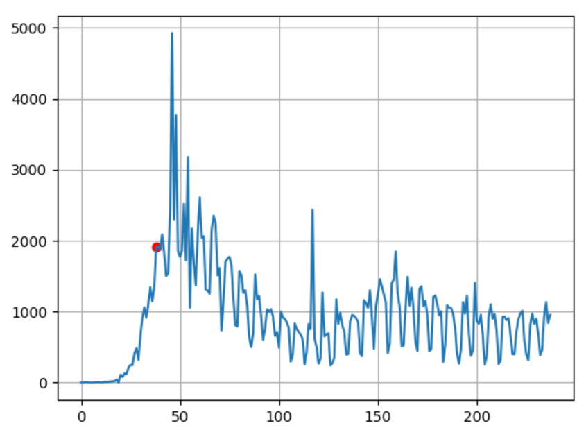
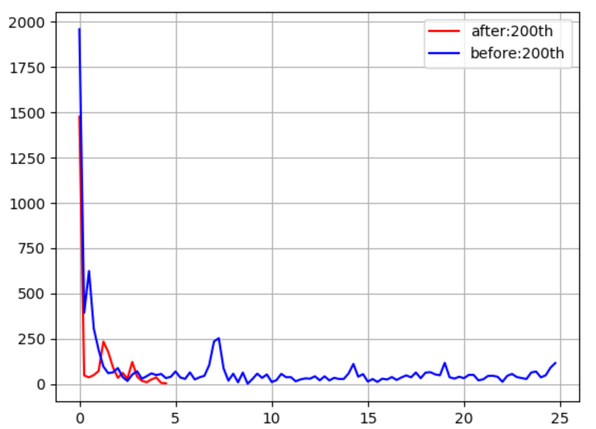
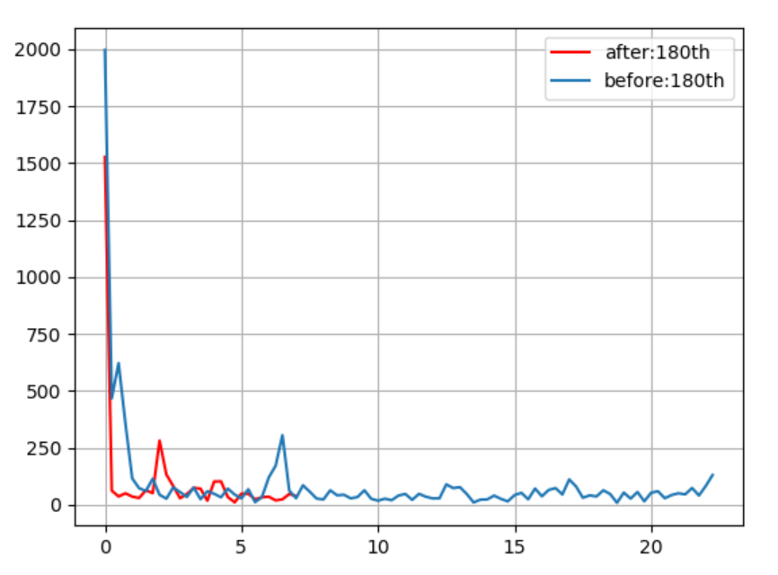
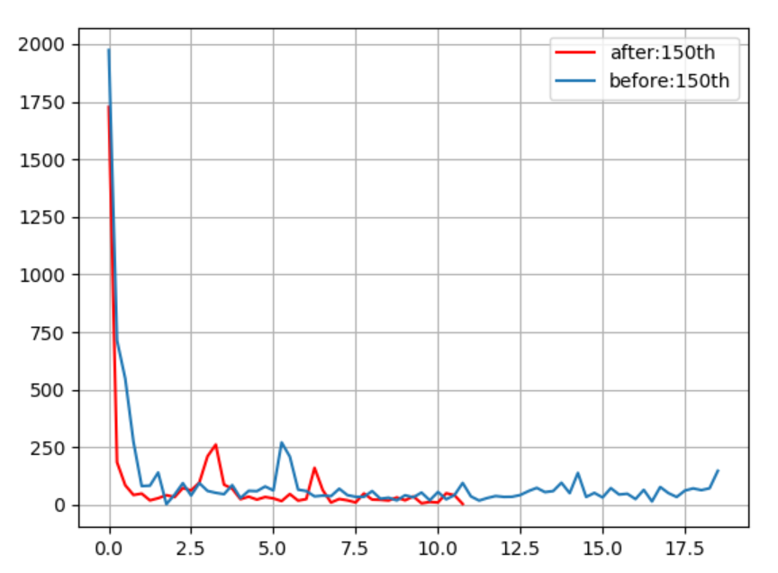
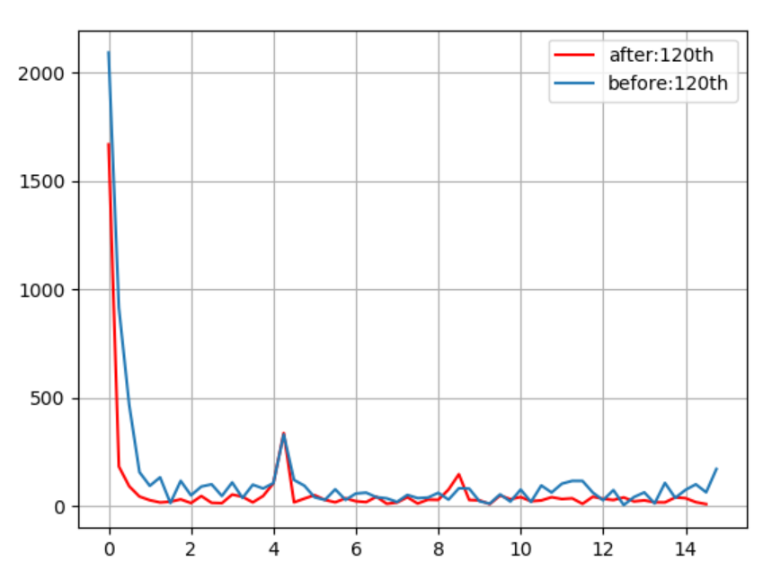
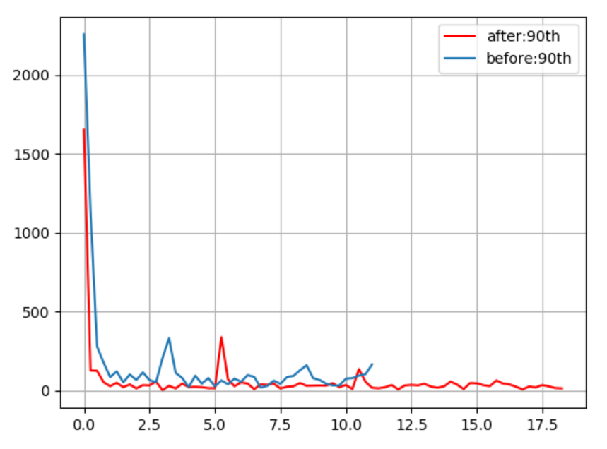
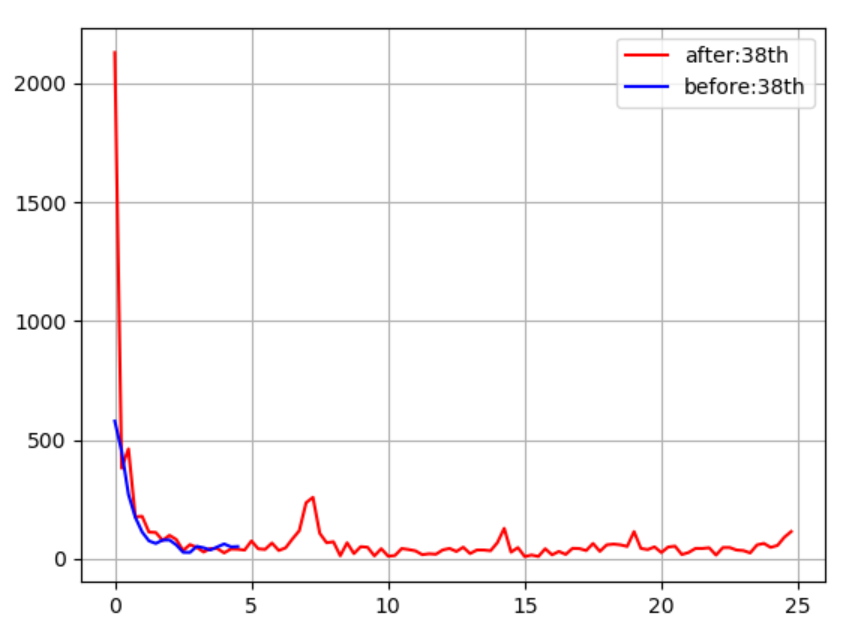

# fourier
The paper entitled "Fourier analysis using the number of COVID-19 daily deaths in the US" 
was published in Epidemiology and Infection.
<a href="https://doi.org/10.1017/S0950268821000522"> Epidemiology&infection (2021)</a>

https://doi.org/10.1017/S0950268821000522

In order to run Python programs, see the following site for novice to install the necessary libraries:
https://github.com/ytakefuji/python-novice

us-fft0.py is for generating the graph of the number of daily deaths in the US due to the covid-19 from March 1 to Oct.24 in 2020.

us-fft2.py is for generating the graph of the fourier spectrum of the last 200 days from Oct. 24 in 2020.

The following graphs show the cycle period of the pandemic.

